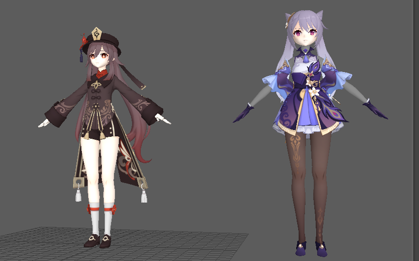

### 将原神模型导入maya教程

在这里附上原神模型的下载链接,以下以胡桃作为示例:

[《原神》迫近的客星视频征集计划 (biligame.com)](http://ys.biligame.com/pjdkx/)

以下的链接当中可以跳转到目前已知的原神模型:

https://www.bilibili.com/read/cv12473334

**请注意,为了后续处理的方便,这里我们尽可能下载到英文路径当中,所有的命名也尽量使用英文命名(包括官方给的模型贴图,由于是中文命名直接导入maya可能会出现问题,这个一会会说),否则可能后续会出现意想不到的错误**

**注:如果只需要导入pmx editor的话中文路径和命名也是可以的,但想要导入maya就不行**

**综上:**

**模型名字,路径尽量不要出现中文符号**

在下载之后直接在原文件当中对压缩包进行解压即可

比如我的胡桃模型下载的位置是(虽然我这里写的是新加卷E,但是实际上依然是普通的E盘,读者需要注意这一点,**再次强调不要中文路径!!!**):

##### 1.下载pmx editor

**注:软件的链接需要的可以私聊我获取**

下载之后将软件进行解压,选择这两个汉化版本之一

这个软件是用来解析原神的pmx文件的,下载之后打开模型的**pmx文件**,我们就可以看到人物的基础模型了

我们直接将胡桃的模型用这款软件打开,可以看到如下的内容:

**此时我们就可以做一些简单的二创了,在这里不做展开,以下的内容是针对于如何将模型导入maya的**

##### 2.导入maya之前的准备工作

###### (1)中文路径和命名问题

之前说过,一定要注意中文路径和命名,在这里我们会发现官方的图片命名均为中文格式,这会导致导入maya的时候无法解析文件,因此我们需要**修改中文的名字**

**修改所有的图片名称为英文/拼音也可以**

修改前:

修改后:

此时再打开刚才的pmx文件,我们会发现胡桃的贴图全部消失了,这是因为软件无法定位到我们的贴图文件了

###### (2)重新绑定材质所在的位置

打开刚才的pmx格式文件,做出如下的修改:

这里我们来举一个例子:

修改前:

修改后:

对所有的材质均做出修改,修改后我们发现胡桃已经焕然一新了

###### (3)将修改后的pmx格式文件保存

按CTRL+S,将文件**保存在英文路径下,取名为英文名字**,在这里我们建议**直接保存在模型下载的路径当中**,这也是为了方便后续的工作:

打开保存后的文件并且检验是否有材质丢失,没有的话进入下一步,有的话看一下之前的步骤是否出现了问题:

###### (4)将pmx格式导出为obj格式

这一步很简单,将我们的pmx格式文件用下述方式来导出,注意英文命名,这里**一定要与模型文件放置在同一个路径文件夹当中!!!!!!!**

**注意上面黑体字**

**注意像下图一样修改一下保存的类型为obj格式**

如果这一步没有出错的话,我们应该可以发现原路径文件夹下出现了**一个obj格式文件和一个mtl格式文件**

**导出的时候出现弹窗设置就按照默认的设置就可以**

##### 3.将obj格式文件导入到maya当中

在这里我们先统一确保一件事情,那就是此时你的文件夹应该跟我的差不多,类似于:

我们在这里必须要在**同一个文件夹中**看到**所有的贴图**,**obj和mtl格式的文件**,**尽量取英文的名字保存在这个英文路径中**

好的,距离胜利只剩下很小的距离了!

**细心的读者可能会试图去打开那个obj文件,但会发现大概率会贴图错误,这个我们马上来说**

##### 4.在maya当中对uv展开进行修正

我们新建一个maya文件,导入我们生成的那个obj的文件:

选择**文件--导入--我们的obj文件**

左侧的是我们导入的结果,可以发现贴图出现问题了

**Q:如果导入之后看不到贴图怎么办?**

**A:查看一下是不是自己的maya忘记按6着色模式(带纹理贴图)了**

###### (1)uv展开

我们直接点击我们的模型选择

**注:对maya不熟悉的朋友可以去了解一下maya的基本操作**

生成的结果如下图所示:

有的朋友看到了可能会很害怕,别担心,修正我们的贴图只需要简单的两步:

**(i)找到哪里错位了**
**(ii)修正就行了**

###### (i)找到哪里错位了

这里我们在面模式下双击原模型的一个面,就可以看到那个面的材质的贴图出现在我们uv的背景中

将我们的uv与背景图片进行比对,看看哪里出错了

**一般来说其实都是一个翻转的错误,比如以我们的胡桃模型为例错误如下:**

**找到一个标志性的图案,然后看一下位置哪里出错了即可,一般都是上下/左右反了**

###### (ii)翻转即可

再次比对,**有的时候运气不好可能需要翻转两次**

最后,只要查看模型是否正确就可以啦.

最后,放置一个结果:

有问题的话欢迎在评论区提出,大家可以一起来探讨.
